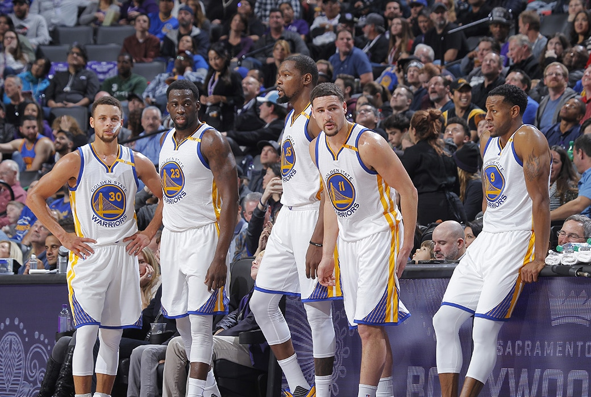
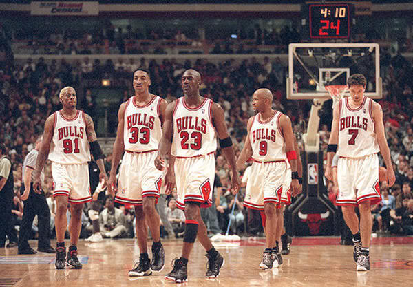
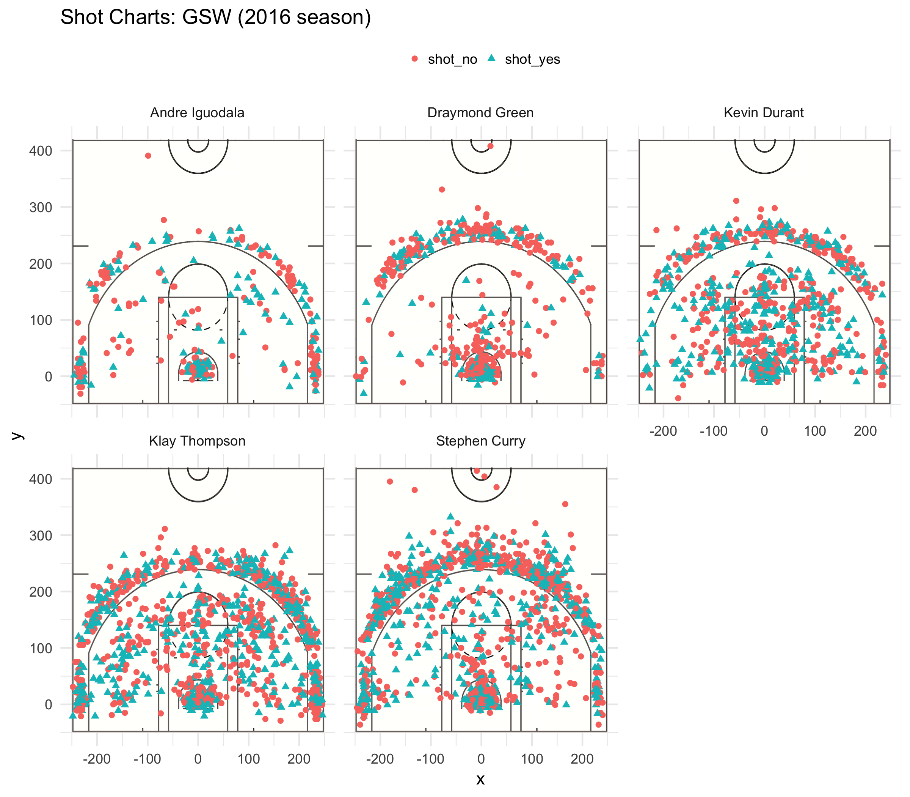

Who is the Greatest NBA Team of All-Time?
================
Pedram Doroudchi
3/9/2019

*The numbers don't lie...* the 2016-17 Golden State Warriors could be the greatest team in NBA history. Having finished the regular season first in the Western Conference with a staggering 67-15 win/loss record, the Warriors went on to hoist the NBA championship by handing the Cleveland Cavaliers a 4-1 gentleman's sweep, no easy feat considering Lebron James had captained the defeated side. Naturally, the question arises: what makes the Golden State Warriors such a seemingly supernatural side and where do they rank amongst the greatest basketball teams of all-time? Let's find out.

When one thinks about the greatest NBA team of all time, the 1995-96 championship-winning Chicago Bulls spring into mind. Spearheaded by the legendary likes of Michael Jordan, Scottie Pippen, Dennis Rodman, and coached by the equally legendary Phil Jackson, this star-studded squad went on to finish the regular season with an all-time win/loss record of 72-10. This mind-boggling record sat untouched for 20 years, until it was one-upped in the 2015-16 season by none other than the Golden State Warriors, who set a trailblazing all-time win/loss record of 73-9. It is common knowledge that every truly great team requires an unstoppable offense, so what is required of the greatest?

#### Stats

##### 3PT Effective Shooting Percentages by Player

                name total made perc_made
    1  Klay Thompson   580  246 0.4241379
    2  Stephen Curry   687  280 0.4075691
    3   Kevin Durant   272  105 0.3860294
    4 Andre Iguodala   161   58 0.3602484
    5 Draymond Green   232   74 0.3189655

Let's talk numbers. Fact: the Warriors are extremely talented three-point shooters. Comparing the average of the Warriors, which can be calculated as `mean(effective_shooting_3pt$perc_made) = .379`, to the league average of `.324`, it is clear that the Warriors blow the opposition out of the water when it comes to banking shots from downtown. However, when you have three of the league's best three-point shooters in Stephen Curry, Klay Thompson, and Kevin Durant, it's not hard to believe the Warriors' superb long-range effective shooting percentage. Though Andre Iguodala and Draymond Green do not possess the three-point shooting prowess of their teammates, they certainly hold their own.

Is this percentage enough to beat out that of the decorated '95-96 Bulls? Yes, and by some margin. The Bulls recorded a relatively weak three-point effective shooting percentage of `.317` based off their starting lineup. However, it is fair to say that the Bulls attempted 1,008 shots while making only 379, substantially less than the Warriors' 1,932 attemmpted and 763 made. It is easy to see then that the Warriors valued the three-point shot in their game more than the Bulls did.

**Fun fact:** Steve Kerr, the current coach of the Golden State Warriors, played on the renowned '95-96 Bulls and held an outstanding `.515` three-point shooting percentage, virtually the highest on the team. If you substitute Steve Kerr for Ron Harper in the starting five (as they were both point guards), the Bulls' three-point effective shooting percentage would soar to `.366`, with 1,141 attempted and 473 made, rivalling that of the '16-17 Warriors.

##### 2PT Effective Shooting Percentages by Player

                name total made perc_made
    1 Andre Iguodala   210  134 0.6380952
    2   Kevin Durant   643  390 0.6065319
    3  Stephen Curry   563  304 0.5399645
    4  Klay Thompson   640  329 0.5140625
    5 Draymond Green   346  171 0.4942197

Looking inside the three-point line, the Warriors are just as good at making two-point field goals, if not better. The average two-point effective shooting percentage of the '16-17 Warriors starting five is `.559`, which is just toying with the league average of `.485`. It's interesting to note that Andre Iguodala doesn't get nearly as many shots as his teammmates and yet retains the highest effective two-point shooting percentage of `.638`, an astonishing figure. This can be attributed to his veteran status; simply put, he has experience and knows better when to capitalize on taking the shot.

Looking at the '95-96 Bulls starting five, their combined average effective two-point shooting percentage amounts to an admirable `.514`, with 3,650 shots attempted and 1,866 made. The number of shots attempted by the Warriors can be calculated by `sum(effective_shooting_2pt$total) = 2,402` and the number made by `sum(effective_shooting_2pt$made) = 1,328`. All in all, the Warriors shot far less two-pointers than the Bulls; the '95-96 Bulls were a two-point team and the '16-17 Warriors were a three-point team. However, the Warriors take the cake when it comes to shooting efficiency percentages anywhere on the court.

##### Overall Effective Shooting Percentages by Player

                name total made perc_made
    1   Kevin Durant   915  495 0.5409836
    2 Andre Iguodala   371  192 0.5175202
    3  Klay Thompson  1220  575 0.4713115
    4  Stephen Curry  1250  584 0.4672000
    5 Draymond Green   578  245 0.4238754

Summarizing the numbers, the '16-17 Warriors held an average overall effective shooting percentage of `.484`, eclipsing the oppositon's relatively weak average of `.448`. By far the most efficient shooter on the Warriors was 2013-14 MVP award winner Kevin Durant, who made over half of his shots. His efficiency can truly be appreciated when looking at his overall shot chart compared to that of the other GSW starting five:

It is easy to see that Durant makes his shots no matter where on the court he shoots, and he does so more efficiently than Klay Thompson or Stephen Curry, who are equally talented but shoot substantially more than Durant. It is important to note that Durant is especially efficient from within the paint. This can be attributed to his sheer size; standing at 6'9" tall, Durant possesses the height of a typical center while also holding impeccable shooting skill. It's no wonder Kevin Durant is one of the most efficient shooters around because few players can effectively guard him.

#### Buzzer Beater

So, who is the best NBA team in history? The '95-96 Bulls' overall shooting percentage of `.479` comes nail-bitingly close to the '16-17 Warriors' `.484`. On paper, it's truly difficult to pick a decisive winner. Simply put, each team is a winner in their own regard and there are several other teams in NBA history that warrant entry into the discussion. Frankly, what each team has accomplished is unreal, and both will be respected and remembered for years to come.

#### References

<https://bleacherreport.com/articles/865311-10-greatest-nba-teams-of-all-time#slide11>

<https://www.basketball-reference.com/teams/GSW/2017.html>

<https://www.basketball-reference.com/teams/CHI/1996.html>
